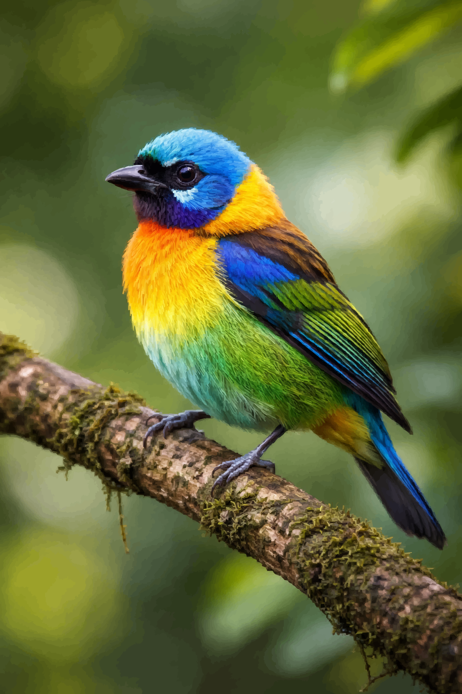
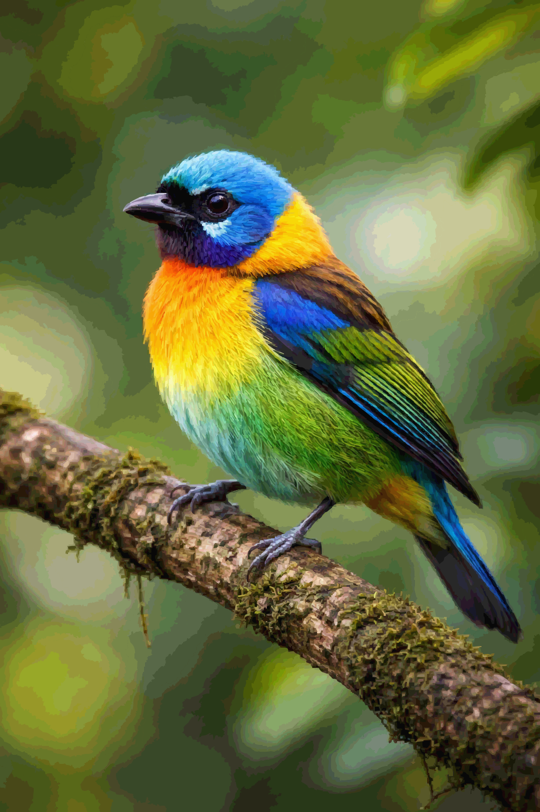
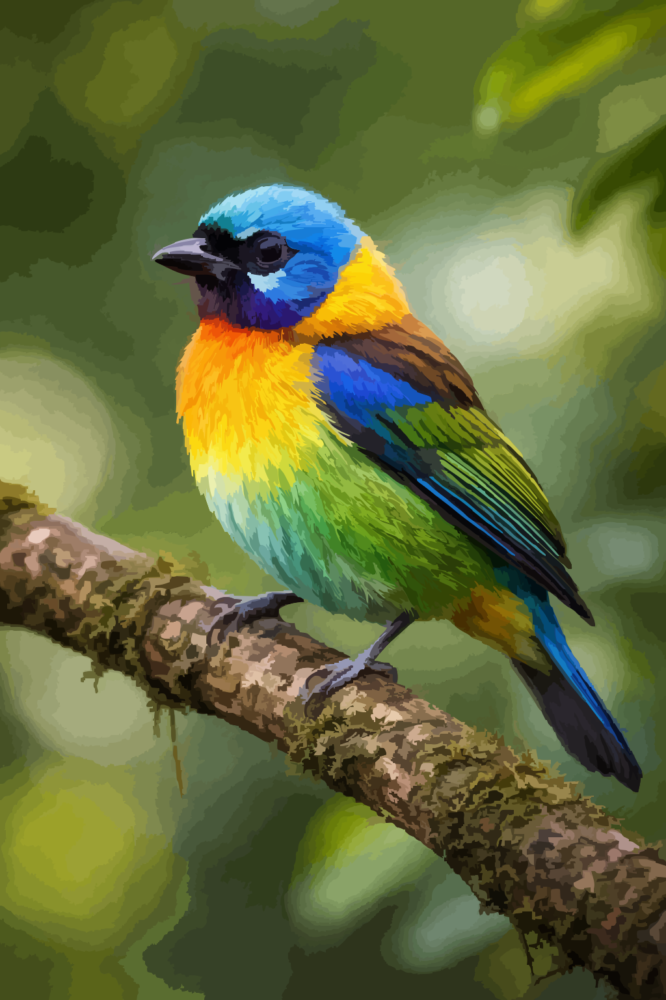
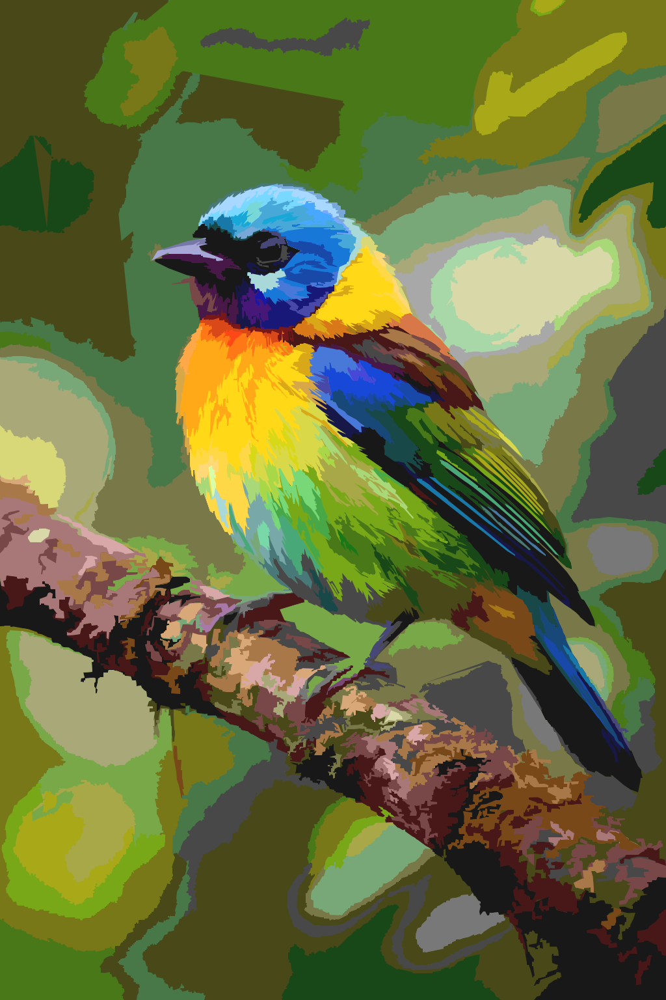

# VectorHealer: KI-SVG Optimierungs-Pipeline

### VON 17.000 PFADEN ZU WEB-TAUGLICHER PRÄZISION

> **Das Problem:** KI-Vektorisierer erzeugen oft ein "Pfad-Chaos" — tausende winzige, überlappende Fragmente, inkonsistente Farben und massive Dateigrößen (10MB+).
> **Die Lösung:** Eine 5-stufige Pipeline, die Farbauflösung (Quantisierung) und Shapely-basiertes "Topology Healing" nutzt, um die Dateigröße um bis zu 90 % zu reduzieren, während die visuelle Integrität erhalten bleibt.

-----

## 🛠 DIE 5-STUFIGE PIPELINE

### 01 | Roh-Vektorisierung

Nutzt `vtracer`, um `bird.png` in eine hochdetaillierte SVG zu verwandeln.

  * **Output:** `bird_vectorized.svg` (\~10MB)

### 02 | Farbauflösung (Quantisierung)

Reduziert über 2.500 Nuancen auf eine saubere Palette (z. B. 64–256 Farben). Dies ist der **Enabler** (Ermöglicher) für das Zusammenführen von Pfaden.

  * **Output:** `bird_colors_merged.svg`

### 03 | Topology Healing (Das Herzstück)

Nutzt die Rechenpower des Mac M4 Pro, um benachbarte Polygone der gleichen Farbe mit `Shapely` zu soliden Flächen zu verschmelzen.

  * **Output:** `bird_paths_merged.svg`

### 04 | Web-Destillation

Douglas-Peucker-Vereinfachung und Rundung der Koordinaten.

  * **Output:** `bird_web-optimized.svg` (\< 700KB)

-----

## 📈 VISUELLER VERLAUF

| Stufe | Visuelles Ergebnis | Dateigröße | Pfad-Anzahl |
| :--- | :--- | :--- | :--- |
| **Original** |  | 2.23 MB | - |
| **Roh-Vektor** |  | 10.2 MB | 17.164 |
| **Quantisiert** |  | 10.2 MB | 17.164 |
| **Geheilt** |  | 3.06 MB | 1.352 |
| **Optimiert** |  | **667 KB** | **81** |

-----

## 🔧 FEINTUNING & FEHLERBEHEBUNG

**"Das Ergebnis wirkt zu blockartig/abstrakt"**

  * Verringere die `step`-Größe in `02_color_quantizer.py` (z. B. von 16 auf 8).
  * Reduziere die `simplify`-Toleranz in `03_topology_healer.py` (z. B. auf 0.05).

**"Kleine Details (Augen) verschwinden"**

  * Prüfe die "Smart Simplify"-Logik in Skript 03. Stelle sicher, dass der Schwellenwert `area < 40` aktiv ist, um kleine Polygone vor der Vereinfachung zu schützen.

